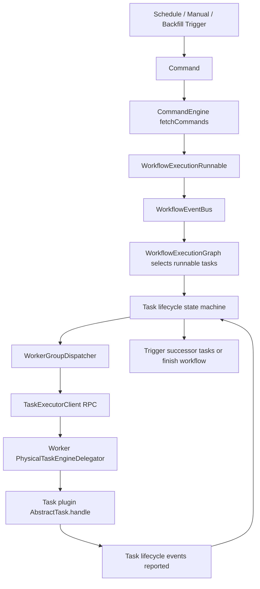

# DolphinScheduler 任务调度机制与 XXL-JOB 功能对比

> 说明：本文结合 DolphinScheduler 3.4.x 官网 JDBC 注册中心文档、当前源码，以及 XXL-JOB 官方开源资料整理。用户给出的 DS 官网链接为：<https://dolphinscheduler.apache.org/zh-cn/docs/3.4.1/guide/installation/registry-plugins/jdbc>。

## 1. DolphinScheduler 的定位

DolphinScheduler（以下简称 DS）不是单点定时任务框架，而是面向数据平台/数据集成/离线批处理场景的分布式工作流调度系统。它的核心模型是“工作流 DAG + 任务插件 + 分布式 Master/Worker + 元数据数据库 + 注册中心”。

从源码看，DS 的调度不是一次简单的 HTTP/RPC 触发，而是一条多阶段链路：

1. Quartz 负责定时计划触发。
2. Master 将触发转换成 `Command`。
3. `CommandEngine` 消费命令并创建工作流实例运行上下文。
4. 工作流事件总线驱动 DAG 状态机。
5. Master 按依赖关系挑选可运行任务。
6. 任务进入 WorkerGroup 分发队列。
7. Worker 执行具体任务插件。
8. Worker 回报生命周期事件，Master 更新任务状态并继续推进 DAG。

## 2. JDBC 注册中心在调度体系中的作用

DS 官网 JDBC 注册中心文档说明：JDBC 注册中心使用数据库保存注册中心元数据。启用方式是将 `registry.type` 设置为 `jdbc`，并初始化对应 SQL 表；由于 Worker 服务默认不包含数据源，文档要求在 Worker 的 `application.yml` 中为注册中心配置 `registry.hikari-config`。

源码中 JDBC 注册中心的核心实现位于：

- `dolphinscheduler-registry/dolphinscheduler-registry-api/src/main/java/org/apache/dolphinscheduler/registry/api/Registry.java`
- `dolphinscheduler-registry/dolphinscheduler-registry-plugins/dolphinscheduler-registry-jdbc/src/main/java/org/apache/dolphinscheduler/plugin/registry/jdbc/JdbcRegistry.java`
- `dolphinscheduler-registry/dolphinscheduler-registry-plugins/dolphinscheduler-registry-jdbc/src/main/java/org/apache/dolphinscheduler/plugin/registry/jdbc/server/JdbcRegistryServer.java`
- `dolphinscheduler-registry/dolphinscheduler-registry-plugins/dolphinscheduler-registry-jdbc/src/main/resources/mysql_registry_init.sql`

它主要承担：

- Master/Worker/Alert 节点注册与发现。
- 临时节点语义：通过客户端心跳和过期清理模拟 ZooKeeper 的 ephemeral node。
- 分布式锁：通过数据库唯一键和锁表实现。
- 注册数据变更通知：通过数据变更事件表轮询感知。

这意味着使用 JDBC 注册中心时，调度链路仍然是 DS 原来的 Master/Worker 机制，只是服务发现、HA 协调和锁能力从 ZooKeeper 替换成数据库表。

## 3. DS 任务调度主流程

### 3.1 定时计划进入 Quartz

DS 的调度计划最终由 Quartz 承载。源码入口：

- `dolphinscheduler-scheduler-plugin/dolphinscheduler-scheduler-quartz/src/main/java/org/apache/dolphinscheduler/scheduler/quartz/QuartzScheduler.java`
- `dolphinscheduler-scheduler-plugin/dolphinscheduler-scheduler-quartz/src/main/java/org/apache/dolphinscheduler/scheduler/quartz/ProcessScheduleTask.java`

`QuartzScheduler.insertOrUpdateScheduleTask` 会根据 `Schedule` 创建 `CronTrigger` 和 `JobDetail`，注册到 Quartz。Quartz 到点后执行 `ProcessScheduleTask.executeInternal`。

`ProcessScheduleTask` 做几件事：

- 从 `JobDataMap` 中读取 projectId、scheduleId。
- 查询 `Schedule` 是否存在、是否上线。
- 查询绑定的 `WorkflowDefinition` 是否存在、是否上线。
- 构造 `WorkflowScheduleTriggerRequest`。
- 调用 `IWorkflowControlClient.scheduleTriggerWorkflow(...)` 触发工作流。

所以 Quartz 并不直接执行任务，它只是生成“工作流触发请求”。

### 3.2 触发请求转换成 Command

手动运行、定时调度、补数、失败恢复、暂停恢复等入口，都会统一落到 `Command` 模型。

相关源码：

- `dolphinscheduler-master/src/main/java/org/apache/dolphinscheduler/server/master/engine/workflow/trigger/WorkflowScheduleTrigger.java`
- `dolphinscheduler-master/src/main/java/org/apache/dolphinscheduler/server/master/engine/workflow/trigger/WorkflowManualTrigger.java`
- `dolphinscheduler-master/src/main/java/org/apache/dolphinscheduler/server/master/engine/workflow/trigger/WorkflowBackfillTrigger.java`
- `dolphinscheduler-service/src/main/java/org/apache/dolphinscheduler/service/command/CommandServiceImpl.java`

这种设计的好处是：不管触发来源是什么，Master 后续都消费统一的命令表，方便 HA、失败转移、补数、恢复和审计。

### 3.3 Master 消费 Command 并创建工作流运行对象

核心类：

- `dolphinscheduler-master/src/main/java/org/apache/dolphinscheduler/server/master/engine/command/CommandEngine.java`
- `dolphinscheduler-master/src/main/java/org/apache/dolphinscheduler/server/master/engine/command/IdSlotBasedCommandFetcher.java`
- `dolphinscheduler-master/src/main/java/org/apache/dolphinscheduler/server/master/engine/workflow/runnable/WorkflowExecutionRunnableFactory.java`
- `dolphinscheduler-master/src/main/java/org/apache/dolphinscheduler/server/master/engine/workflow/runnable/WorkflowExecutionRunnable.java`

`CommandEngine` 是 Master 里的命令消费循环。它会：

- 判断当前 Master 是否过载。
- 从数据库抓取可处理的 `Command`。
- 使用线程池并发处理命令。
- 根据命令创建 `WorkflowExecutionRunnable`。
- 将工作流放入 `IWorkflowRepository`。
- 注册 `WorkflowEventBus`。
- 发布 `WorkflowStartLifecycleEvent`。

这里是 DS 和简单任务调度框架的重要差异：DS 的运行单元首先是工作流实例，而不是单个 job。

### 3.4 工作流事件总线和状态机推进 DAG

核心类：

- `dolphinscheduler-master/src/main/java/org/apache/dolphinscheduler/server/master/engine/WorkflowEngine.java`
- `dolphinscheduler-master/src/main/java/org/apache/dolphinscheduler/server/master/engine/WorkflowEventBus.java`
- `dolphinscheduler-master/src/main/java/org/apache/dolphinscheduler/server/master/engine/WorkflowEventBusCoordinator.java`
- `dolphinscheduler-master/src/main/java/org/apache/dolphinscheduler/server/master/engine/workflow/statemachine/WorkflowRunningStateAction.java`
- `dolphinscheduler-master/src/main/java/org/apache/dolphinscheduler/server/master/engine/graph/WorkflowExecutionGraph.java`

`WorkflowEngine.start()` 会启动：

- `WorkflowEventBusCoordinator`
- `CommandEngine`
- `WorkerGroupDispatcherCoordinator`
- `LogicTaskEngineDelegator`

工作流进入运行态后，`WorkflowRunningStateAction.onStartEvent` 会从 `WorkflowExecutionGraph` 中取出起始节点，并触发这些任务。每个任务完成后，Master 会发布 `WorkflowTopologyLogicalTransitionWithTaskFinishLifecycleEvent`，再由状态机判断后继节点是否满足依赖条件。

也就是说，DS 的 DAG 推进不是 Worker 自己决定的，而是 Master 根据工作流执行图、任务状态和依赖关系集中推进。

### 3.5 任务生命周期与分发

核心类：

- `dolphinscheduler-master/src/main/java/org/apache/dolphinscheduler/server/master/engine/task/statemachine/AbstractTaskStateAction.java`
- `dolphinscheduler-master/src/main/java/org/apache/dolphinscheduler/server/master/engine/task/statemachine/TaskDispatchStateAction.java`
- `dolphinscheduler-master/src/main/java/org/apache/dolphinscheduler/server/master/engine/task/dispatcher/WorkerGroupDispatcher.java`
- `dolphinscheduler-master/src/main/java/org/apache/dolphinscheduler/server/master/engine/task/client/TaskExecutorClient.java`

任务从 DAG 中被选中后，会经历任务生命周期事件：

- start
- dispatch
- dispatched
- running
- success / failed / killed / paused
- retry / failover

`AbstractTaskStateAction.tryToDispatchTask` 会判断是否需要申请 TaskGroup 资源槽位。若不需要或申请成功，则发布 `TaskDispatchLifecycleEvent`。

`WorkerGroupDispatcher` 负责按 WorkerGroup 分发任务。它内部维护等待分发集合和延迟队列。分发失败时会重入队列，并按失败次数增加等待时间，最长等待 60 秒。配置打开 dispatch timeout 后，超过阈值会直接将任务置为失败。

### 3.6 Worker 执行任务插件

核心类：

- `dolphinscheduler-worker/src/main/java/org/apache/dolphinscheduler/server/worker/WorkerServer.java`
- `dolphinscheduler-worker/src/main/java/org/apache/dolphinscheduler/server/worker/rpc/PhysicalTaskExecutorOperatorImpl.java`
- `dolphinscheduler-worker/src/main/java/org/apache/dolphinscheduler/server/worker/executor/PhysicalTaskEngineDelegator.java`
- `dolphinscheduler-worker/src/main/java/org/apache/dolphinscheduler/server/worker/executor/PhysicalTaskExecutor.java`
- `dolphinscheduler-task-executor/src/main/java/org/apache/dolphinscheduler/task/executor/worker/TaskExecutorWorker.java`

Worker 启动时会：

- 启动 Worker RPC 服务。
- 加载任务插件。
- 加载数据源插件。
- 注册到注册中心。
- 启动物理任务执行引擎。

Master 将任务通过 RPC 分发给 Worker 后，Worker 的 `PhysicalTaskExecutorOperatorImpl.dispatchTask` 接收 `TaskExecutionContext`，交给 `PhysicalTaskEngineDelegator` 创建 `PhysicalTaskExecutor`，再由 `TaskEngine` 执行。

`PhysicalTaskExecutor` 会：

- 初始化任务上下文。
- 创建执行目录。
- 下载资源。
- 通过任务插件工厂创建具体 `AbstractTask`。
- 调用插件的 `handle(...)` 执行任务。
- 跟踪插件退出状态并上报事件。

### 3.7 状态回传和继续推进

Worker 通过生命周期事件将任务状态回报给 Master。Master 侧任务状态机更新数据库中的 `TaskInstance`，释放资源槽位，合并变量池，并发布工作流拓扑推进事件。

如果任务成功，Master 判断后继节点是否可以触发；如果失败，则根据失败策略、重试策略、条件分支和工作流状态决定继续、失败、暂停或停止。

## 4. 调度链路图

## 5. DS 的生产级调度能力

结合源码，DS 的生产级能力主要体现在：

| 能力 | DS 中的体现 |
|---|---|
| DAG 工作流 | `WorkflowExecutionGraph` 维护任务依赖、起始节点、后继触发、链路成功/失败状态 |
| 多触发来源 | 定时、手动、补数、失败恢复、暂停恢复等都转为 `Command` |
| 分布式 Master | Master 注册到注册中心，命令消费支持多 Master 协同 |
| Worker 分组 | 任务根据 WorkerGroup 分发，`WorkerGroupDispatcher` 分组维护队列 |
| 注册中心可插拔 | `Registry` 接口屏蔽 ZooKeeper/JDBC/Etcd 实现 |
| 任务插件体系 | Worker 加载任务插件，具体任务由插件执行 |
| 资源控制 | TaskGroup slot、Worker 负载保护、Master 负载保护 |
| 状态机 | 工作流状态机和任务状态机分别处理生命周期事件 |
| 补数/串行/恢复 | Backfill、Serial Command、Recover Failure/Suspend 等命令处理器 |
| Failover | Master/Worker 失效由注册中心与 failover coordinator 处理 |
| 数据平台能力 | 支持变量池、资源下载、租户、环境、告警、数据源插件等 |

## 6. XXL-JOB 的定位与调度模型

XXL-JOB 是轻量级分布式任务调度平台，典型架构是：

- 调度中心 Admin：负责触发、调度、管理、日志查看。
- 执行器 Executor：业务应用接入执行器 SDK，注册到调度中心。
- JobHandler：业务侧实现具体任务处理逻辑。

它的核心模型是“一个调度任务触发一个 JobHandler”。XXL-JOB 支持 Cron、固定速度、失败重试、路由策略、分片广播、日志、告警、动态注册执行器等能力，非常适合业务系统中的定时任务治理。

但从模型上看，XXL-JOB 不是数据工作流引擎。它可以通过任务链路或人工组织实现简单依赖，但它的核心不是 DAG 编排。

## 7. DS 与 XXL-JOB 功能对比

| 对比项 | DolphinScheduler | XXL-JOB | 差异说明 |
|---|---|---|---|
| 核心模型 | 工作流 DAG + 任务节点 | 单 Job / JobHandler | DS 天然处理多任务依赖；XXL-JOB 更偏单任务调度 |
| 任务依赖 | 支持 DAG 拓扑依赖、条件、后继推进 | 主要是单任务触发，依赖编排能力有限 | XXL-JOB 缺少 DS 这种一等公民级 DAG 引擎 |
| 数据任务类型 | Shell、SQL、Spark、Flink、Python、DataX、依赖任务等插件 | Java Handler、GLUE、Shell 等 | DS 面向数据平台的任务插件更丰富 |
| 补数能力 | 有 Backfill/Complement Data 机制 | 通常需手动重跑或自行组织参数 | DS 更适合历史区间批量补数 |
| 工作流实例 | 有 WorkflowInstance、TaskInstance 两级实例 | 主要是 Job 执行日志 | DS 对复杂流程实例追踪更完整 |
| 状态机 | 工作流状态机 + 任务状态机 | Job 执行状态 | DS 状态更细，支持 DAG 推进、暂停、恢复、Failover |
| 分布式 HA | Master/Worker 注册中心、Failover、命令表协同 | Admin 集群 + Executor 注册 | 两者都支持分布式，但 DS 的 HA 围绕工作流和任务接管更复杂 |
| Worker 分组 | WorkerGroup、资源槽位、负载保护 | 执行器 AppName、路由策略 | DS 更偏资源调度；XXL-JOB 更偏选择执行器 |
| 任务资源治理 | TaskGroup slot、租户、环境、资源下载 | 路由、阻塞策略、超时、重试 | DS 更适合多租户数据任务资源隔离 |
| 运行上下文 | 变量池、全局/局部参数、任务输出传递 | Job 参数为主 | DS 更适合上下游参数传递 |
| 可视化编排 | DAG 可视化工作流 | 任务配置与日志管理 | DS 编排能力更强 |
| 插件扩展 | 注册中心、任务、数据源、存储等插件 | Executor/JobHandler 扩展 | DS 插件面覆盖平台层；XXL-JOB 偏业务执行层 |
| 适用场景 | 数据开发、离线调度、ETL、复杂依赖、补数 | 业务定时任务、轻量分布式调度、Java 应用任务治理 | 两者不是完全替代关系 |

## 8. 相比 DS，XXL-JOB 主要缺少或较弱的能力

### 8.1 原生 DAG 工作流编排

DS 的任务调度核心围绕 `WorkflowExecutionGraph`，每个任务节点完成后都会触发拓扑推进。XXL-JOB 的核心是 Job 触发和执行器路由，不是 DAG 图执行引擎。

这导致 XXL-JOB 在以下场景需要额外开发：

- A、B 成功后才能执行 C。
- 某个任务失败后按分支进入补偿任务。
- 条件节点决定后续路径。
- 子工作流、依赖工作流、复杂跨任务参数传递。

### 8.2 补数与数据周期能力

DS 有 `WorkflowBackfillTrigger`、`BackfillWorkflowCommandHandler` 等补数链路，可以按业务日期、时间区间生成补数命令。XXL-JOB 可以通过参数手动触发历史日期任务，但缺少 DS 这种工作流级补数模型。

### 8.3 数据平台任务插件生态

DS Worker 会加载任务插件和数据源插件，任务执行上下文包含资源、租户、环境、变量池等信息。XXL-JOB 更适合业务应用内的 Java Handler 或脚本任务，不专注数据计算组件编排。

### 8.4 工作流级 Failover 和恢复

DS 的 Master/Worker 都通过注册中心参与 HA。Master 侧有 `FailoverCoordinator`、`WorkflowFailover`、`TaskFailover`，任务状态机也有 Failover 事件。XXL-JOB 具备调度中心集群和执行器注册，但工作流级接管、DAG 状态恢复不是它的核心能力。

### 8.5 资源和多租户治理

DS 有 WorkerGroup、TaskGroup、租户、环境、Worker/Master 负载保护等机制。XXL-JOB 的执行器路由策略和阻塞策略足够处理普通业务定时任务，但在多租户数据平台资源治理上不如 DS 完整。

### 8.6 工作流实例级观测

DS 同时记录工作流实例和任务实例，能展示 DAG 中每个节点的状态、上下游关系、变量、日志和失败恢复入口。XXL-JOB 的观测更偏单 Job 执行日志与调度结果。

## 9. 什么时候选 DS，什么时候选 XXL-JOB

| 场景 | 更适合 |
|---|---|
| 数据仓库/湖仓离线调度 | DS |
| 多任务依赖 DAG、跨系统 ETL | DS |
| Spark/Flink/DataX/Shell/SQL 混合编排 | DS |
| 大量业务系统定时任务统一管理 | XXL-JOB |
| Java 应用内周期性任务、简单脚本任务 | XXL-JOB |
| 希望接入成本低、轻量部署 | XXL-JOB |
| 需要补数、依赖、可视化流程治理 | DS |

## 10. 结论

DS 和 XXL-JOB 都是优秀的开源调度系统，但它们解决的问题层级不同。

XXL-JOB 的优势是轻量、简单、接入业务应用方便，适合“分布式定时任务治理”。DS 的优势是工作流 DAG、数据任务插件、补数、资源治理、状态机和 Failover，适合“数据平台级任务编排”。

如果生产场景只是业务服务里的定时任务，例如定时同步缓存、发送通知、调用接口、清理数据，XXL-JOB 足够直接。如果生产场景涉及复杂依赖、数据开发、离线批处理、跨任务参数、补数和可视化运维，DS 会更合适。

## 参考资料

- DolphinScheduler JDBC 注册中心文档：<https://dolphinscheduler.apache.org/zh-cn/docs/3.4.1/guide/installation/registry-plugins/jdbc>
- DolphinScheduler 官网：<https://dolphinscheduler.apache.org/>
- DolphinScheduler GitHub：<https://github.com/apache/dolphinscheduler>
- DolphinScheduler 本地文档：`docs/docs/zh/guide/installation/registry-plugins/jdbc.md`
- DolphinScheduler Quartz 调度源码：`dolphinscheduler-scheduler-plugin/dolphinscheduler-scheduler-quartz/src/main/java/org/apache/dolphinscheduler/scheduler/quartz`
- DolphinScheduler Master 调度源码：`dolphinscheduler-master/src/main/java/org/apache/dolphinscheduler/server/master/engine`
- DolphinScheduler Worker 执行源码：`dolphinscheduler-worker/src/main/java/org/apache/dolphinscheduler/server/worker`
- XXL-JOB GitHub：<https://github.com/xuxueli/xxl-job>
- XXL-JOB 文档：<https://www.xuxueli.com/xxl-job/>
